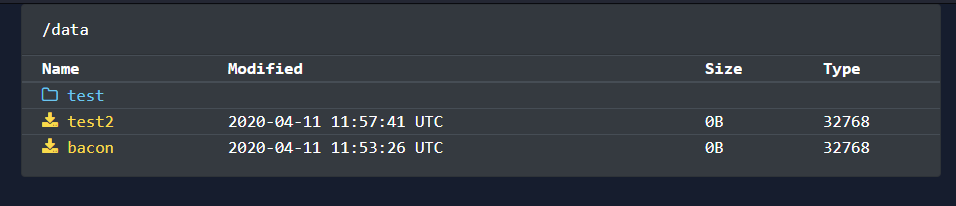

# dirlister

A flask based directory explorer



```bash
export DIRLISTER_TARGET="/your/dir" # defaults to /

gunicorn -b 0.0.0.0:8000 app:app

# or

docker-compose up # change the values if you want a different directory than /mnt
```
