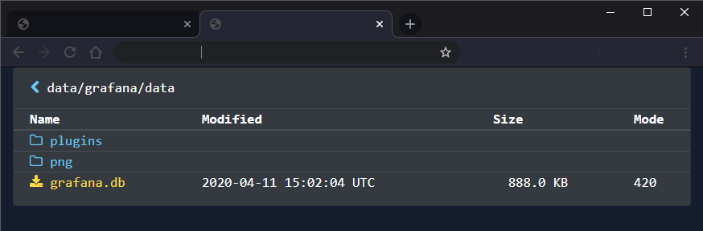

# dirlister

A flask based directory explorer



```bash
export DIRLISTER_TARGET="/your/dir" # defaults to /

pip install pipenv
pipenv sync
pipenv run app

# or

docker-compose up # change the values if you want a different directory than /mnt
```

# filter.yaml

With a filename that looks like this: `one sausage 2021[tag].mp4`

the filter shown below would display it like so: `one sausage.mp4`

```yaml
filters:
    - "[tag]"
    - 2021
    - etc...
```

simply put it at the root of the repo and name it `filter.yaml`
